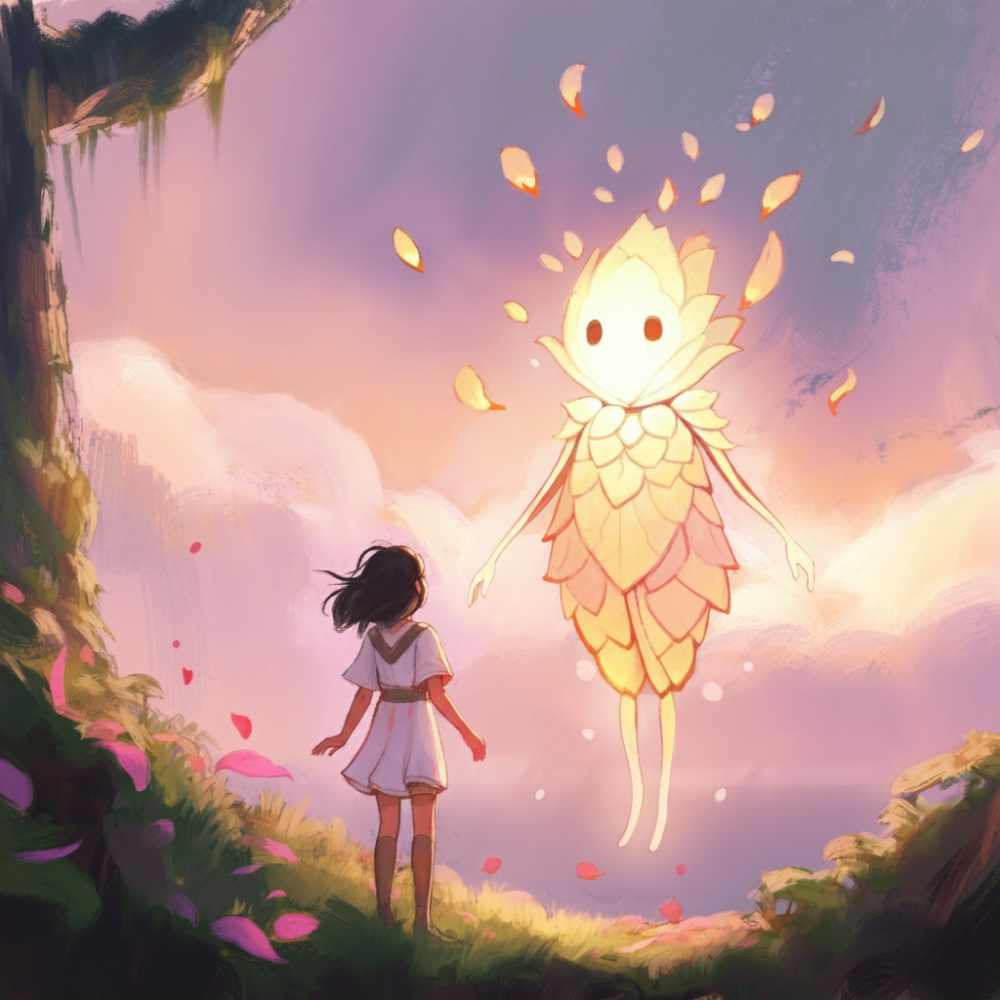

# The Long Way Home

## Background



> Image created by [ImageFX](https://aitestkitchen.withgoogle.com/tools/image-fx)

In this captivating game, you, the player, awaken on a distant island. You have to find a way to escape this island.

## Requirements

- [keras](https://pypi.org/project/keras/)
- [keras-nlp](https://pypi.org/project/keras-nlp/)
- [google-generativeai](https://pypi.org/project/google-generativeai/)
- [Optional] [google-cloud-aiplatform](https://pypi.org/project/google-cloud-aiplatform/) (if you use gemma_vertex.py)

## Get access to Gemma

Before using Gemma, you must request access to the model through Kaggle. Complete the setup instructions at [Gemma setup](https://ai.google.dev/gemma/docs/setup)

## How to run

```
python escape.py
```
